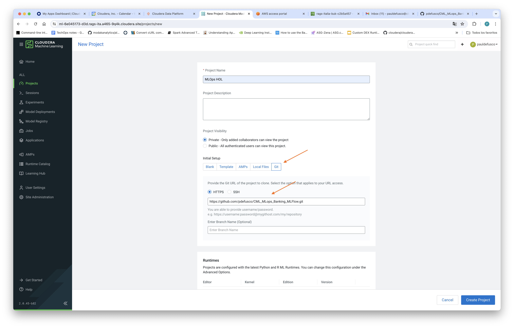
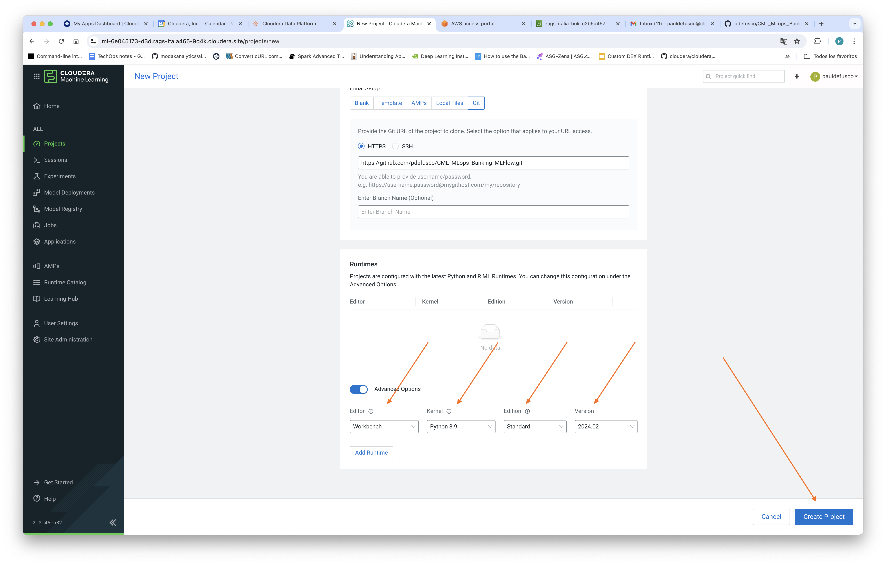
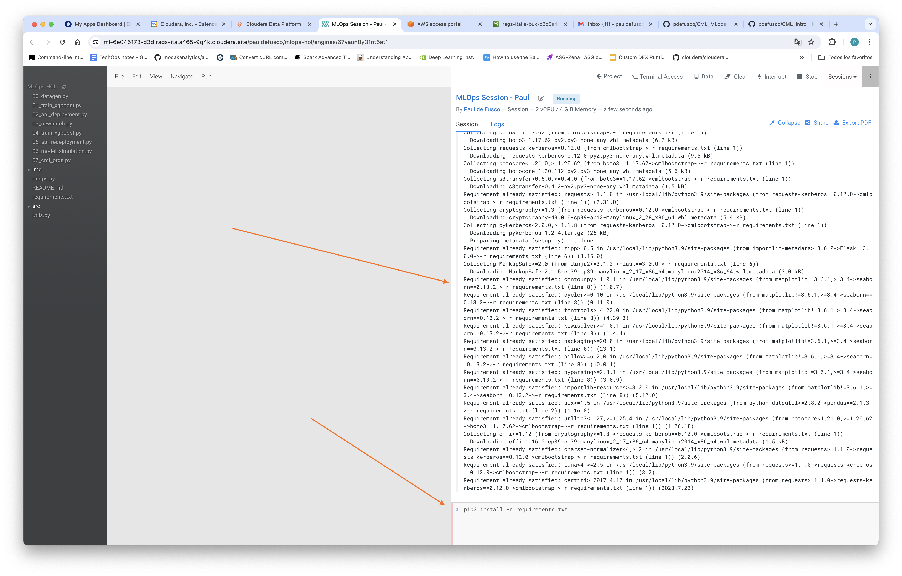

### Italian

## Configurazione

### Obiettivo

Questo documento fornisce istruzioni per configurare il HOL nel tuo spazio di lavoro CML.

### Requisiti

* Spazio di lavoro CML nella versione xxx con tipi di istanze xxx
* Registro MLFlow CML
* Utente CDP con diritti di amministratore CML e configurazione completa in IDBroker Mappings e politiche Hadoop SQL / RAZ di Ranger.
* Profilo risorse runtime CML di 2 vCPU e 4 o 8 GiB

### Istruzioni per la configurazione

1. Distribuisci il progetto CML dal repository Git
2. Crea una sessione CML e installa i requisiti

#### 1. Distribuire il progetto CML dal repository Git

Dall'interno dello spazio di lavoro CML, crea un nuovo progetto e inserisci i seguenti parametri nel modulo:

```
Nome del progetto: MLOps HOL <username>
Visibilità del progetto: Privato o Pubblico
Configurazione iniziale: Git -> https://github.com/pdefusco/CML_MLops_Banking_MLFlow.git
Runtimes :
  1. Rimuovi tutti i runtime predefiniti.
  2. Seleziona Opzioni Avanzate
  3. Seleziona: Editor Workbench / Kernel Python 3.9 / Edizione Standard / Versione 2024.02
```





#### 2. Crea una sessione CML e installa i requisiti

Avvia una sessione CML con:

```
Editor: Workbench
Kernel: Python 3.9
Edizione: Standard
Versione: 2024.02
Abilita Spark: Versione 3.2 o 3.3
Profilo Risorse: 2 vCPU / 4 GiB Memoria / 0 GPU
```

Nel prompt sul lato destro, inserisci il seguente comando:

```
!pip3 install -r requirements.txt
```




Una volta installati tutti i pacchetti, procedi alle istruzioni in 00_datagen.


